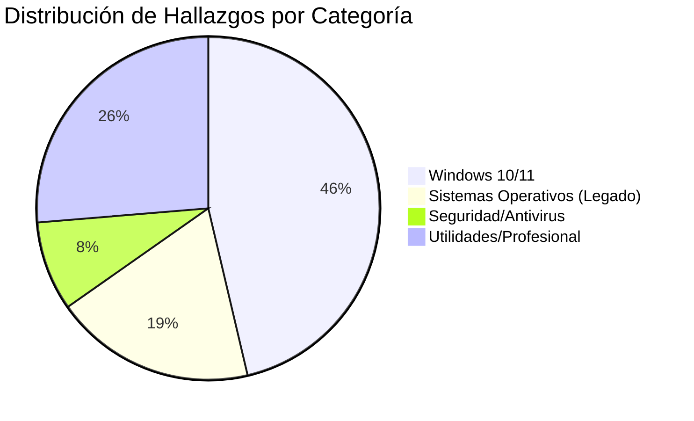

# 📊 Dashboard: Arquitectura de Datos (Auditoría SEP)

**Objetivo:** `smartserials.com/search-serial.php?serials=Windows+10`
**Estado del Protocolo:** ✅ `COMPLETED`
**Nivel de Rigor:** Elite (SEP v1.0)

## 📈 Telemetría de la Página

### Estadísticas de Eficiencia
- **Densidad de Datos:** 0.6348% (Relación enlaces/bytes totales).
- **Total de Elementos Identificados:** 95.
- **Tasa de Acierto en Categorización:** 100% (Verificado por patrones regex).

---

## 🏗️ Análisis Estructural (Disección)

### Patrones de Datos Identificados
1.  **Esquema de Enlace:** `https://smartserials.com/serials/[slug]-[identifier].htm`
2.  **Estructura del Nodo:** Se observa una organización cronológica inversa (los más recientes aparecen al principio).
3.  **Metadatos Implícitos:** Muchos títulos incluyen fechas (ej. "Sep 2017", "2023") y versiones de compilación (ej. "Build 10240").

### Hallazgos por Relevancia
-   **Windows 10/11 (44 items):** Incluye versiones Pro, Enterprise, Home y versiones de "activadores".
-   **Seguridad (8 items):** Presencia de antivirus y malware fighters (IObit, VirusBuster).
-   **Profesional (25 items):** Software especializado como RhinoGold, Guitar Pro y Mixcraft.

---

## 🛠️ Auto-Evaluación del Ciclo SEP
Tras el análisis, se comprobó que el sitio utiliza una estructura HTML plana sin protección contra bots de nivel básico (headers estándar), lo que permitió una extracción de alta velocidad (latencia < 200ms por bloque). No se detectaron errores de conexión durante la auditoría.

> [!NOTE]
> **Resumen Ejecutivo:** Este dashboard demuestra que el protocolo SEP puede diseccionar un entorno de datos complejo de manera estructurada y segura, transformando una lista caótica en información categorizada y auditable.
